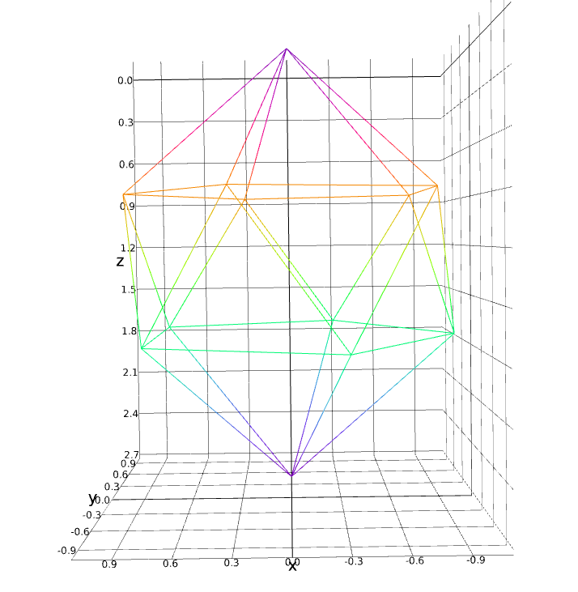
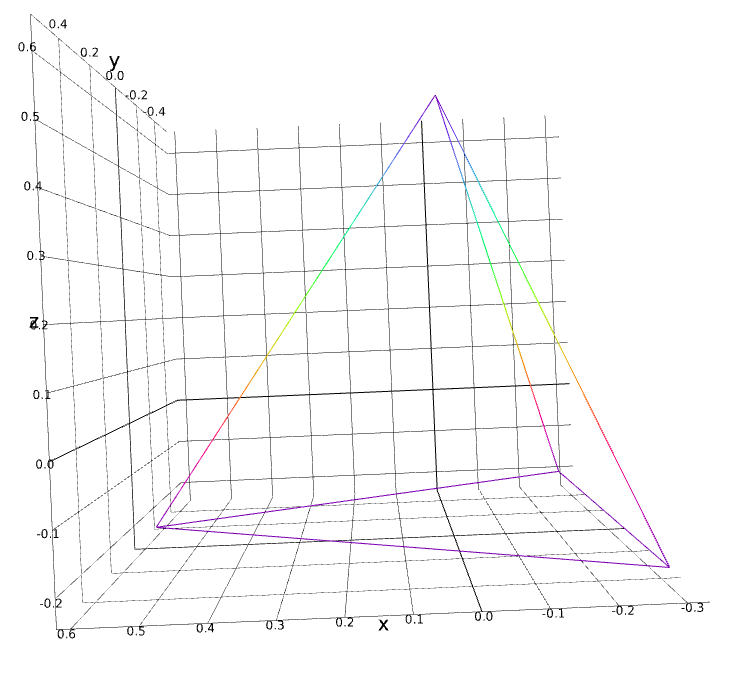

# chandeledra

[light-emitting](https://en.wikipedia.org/wiki/Light-emitting_diode) [polyhedron](https://en.wikipedia.org/wiki/Polyhedron) [chandeliers](https://en.wikipedia.org/wiki/Chandelier)

## background

after playing with [aburndance](https://github.com/ahdinosaur/aburndance), i thought about my learning objectives for the [next stage of portable rainbow exploration](https://viewer.scuttlebot.io/%25sO9UYU8pod1sS7JlpX15rfEtGMZ6znMxZEySYql221Q%3D.sha256):

- i want to go [back to the BeagleBone](https://github.com/ahdinosaur/pixelbeat/tree/bbb), but this time using Rust instead of JavaScript
- i want to get [back into 3d printing](https://github.com/ahdinosaur/prusa-mendel) for enclosures and structures
- i want to upgrade from breadboards to protoboards to custom pcb circuits, out-source soldering!

i was sitting on a hill listening to music at a festival (sober!), when i saw a 20-sided shape hanging over a stage, with fairy lights strung around the edges. :sparkles:

i thought "what if i did the same with leds"? :rainbow:

i then continued to spend the rest of the festival obssessing, which led into this project. :cat:

## design constraints

to simplify production, we want:

- MUST HAVE uniform length edges (easy for buying led strip channels)
- COULD HAVE uniform angle patterns  (easier for making 3d printed joints)

## shapes

### [icosahedron](https://en.wikipedia.org/wiki/Regular_icosahedron)

the original gansta shape!

an icosahedron is a 20-sided shape which regular angle patterns and uniform length edges.

it's also a gyroelgonated pentagonal dipryamid (my original understanding of the shape): on the top and bottom is a [pentagonal pyramid](http://mathworld.wolfram.com/PentagonalPyramid.html), in the middle is an [pentagonal antiprism](https://en.wikipedia.org/wiki/Pentagonal_antiprism)

### [octahedron](https://en.wikipedia.org/wiki/Octahedron)

### [tetrahedron](https://en.wikipedia.org/wiki/Tetrahedron)

## plan

### controller hardware

- [pocketbeagle](https://github.com/beagleboard/pocketbeagle)
- 1x rotary encoder (eQEP)
  - with reset button
- param selector buttons (+ and -)
- mode selector buttons (+ and -)
- brightness potentiometer
- apa102 spi out

nice to have:

- microphone sensitivity potentiometer
- microphone in
- audio jack in

### software

- apa102 spi interface (like [fastled](https://github.com/FastLED/FastLED))
- params interface
- graphics (glsl) interface
  - input
    - time
    - params (param name, encoder value)
    - pixel position [x, y, z]
    - pixel rotation?
  - output: pixel color

### development setup

simulate hardware controller with gtk interface

simulate leds with graphics renderer

### led hardware

have 3d printed joint (like geodesic dome joint) which can connect many "aluminum led channel"s together.

have custom circuit with many 4 pin jst inputs and 4 pin jst outputs.

simple strategy to daisy chain around shape: start at top, go down to bottom, back up and down. save extra edges for final "edge case" run.

### power hardware

- led power protection (like [AllPixel Power Tap Kit](https://www.seeedstudio.com/AllPixel-Power-Tap-Kit-p-2380.html))

## resources

- "led aluminum channel"
- [Platonic solid](https://en.wikipedia.org/wiki/Platonic_solid)
- [Johnson Solids](http://mathworld.wolfram.com/JohnsonSolid.html): regular faces, uniform length edges
- [CGAL](https://doc.cgal.org/latest/Manual/packages.html#PkgPolyhedronSummary)
