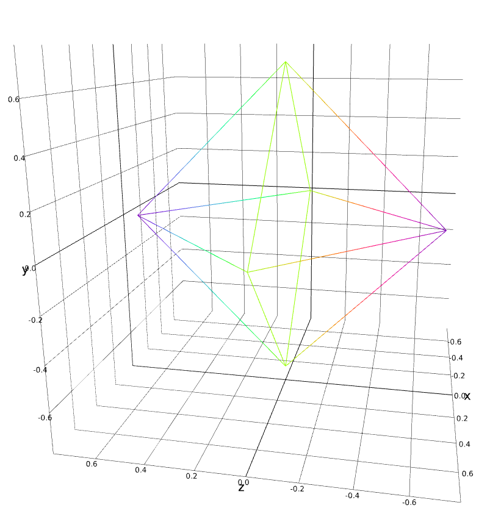

# chandeledra shapes

a JavaScript app to discover new exciting shapes

## usage

install node.js

```shell
npm install
npm start
```

## design

to simplify production, we want:

- uniform length edges (easy for buying led strip channels)
- uniform angle patterns  (easier for making 3d printed joints)
- is [traversable](https://en.wikipedia.org/wiki/Eulerian_path) (easier for using daisy-chained leds)

## shapes

### [icosahedron](https://en.wikipedia.org/wiki/Regular_icosahedron)

the original gansta shape from the festival!

an icosahedron is a 20-sided shape which regular angle patterns and uniform length edges.

it's also a gyroelgonated pentagonal dipryamid (my original understanding of the shape): on the top and bottom is a [pentagonal pyramid](http://mathworld.wolfram.com/PentagonalPyramid.html), in the middle is an [pentagonal antiprism](https://en.wikipedia.org/wiki/Pentagonal_antiprism)


### [octahedron](https://en.wikipedia.org/wiki/Octahedron)


### [tetrahedron](https://en.wikipedia.org/wiki/Tetrahedron)



### Cuboctahedron

has a eulerian cycle! https://www.youtube.com/watch?v=A-czqGfMh7A

### star

led strips that start a single center point and explode outwards

### candle

wrap led matrix (grids) into a cylinder

### loops

many concentric circles, like a visualization of an atom: protons in the center, electrons around

### vines

hang led strips from the top, maybe uniform to form a 3d space

## resources

- [Platonic solid](https://en.wikipedia.org/wiki/Platonic_solid)
- [Johnson Solids](http://mathworld.wolfram.com/JohnsonSolid.html): regular faces, uniform length edges
- [CGAL](https://doc.cgal.org/latest/Manual/packages.html#PkgPolyhedronSummary)
